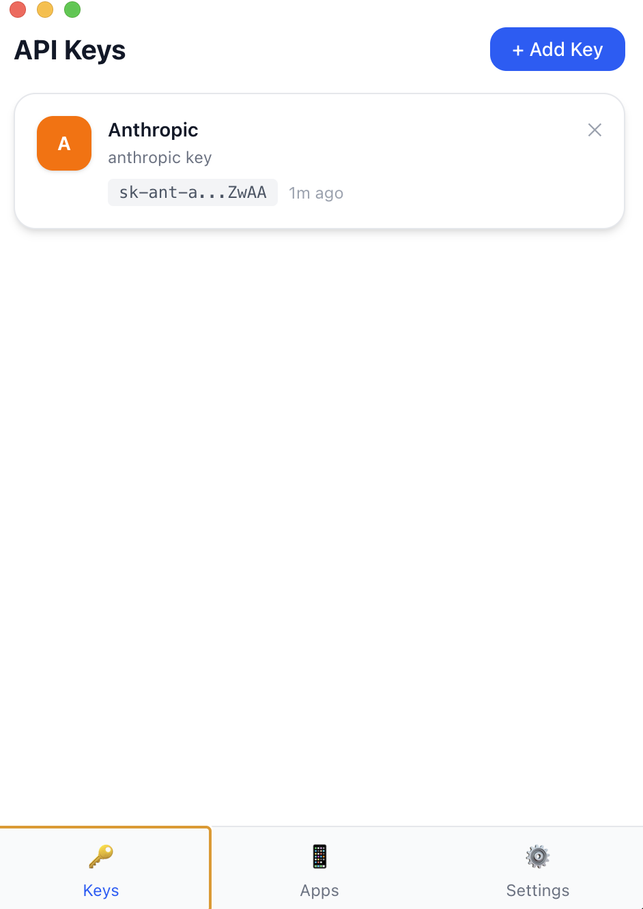
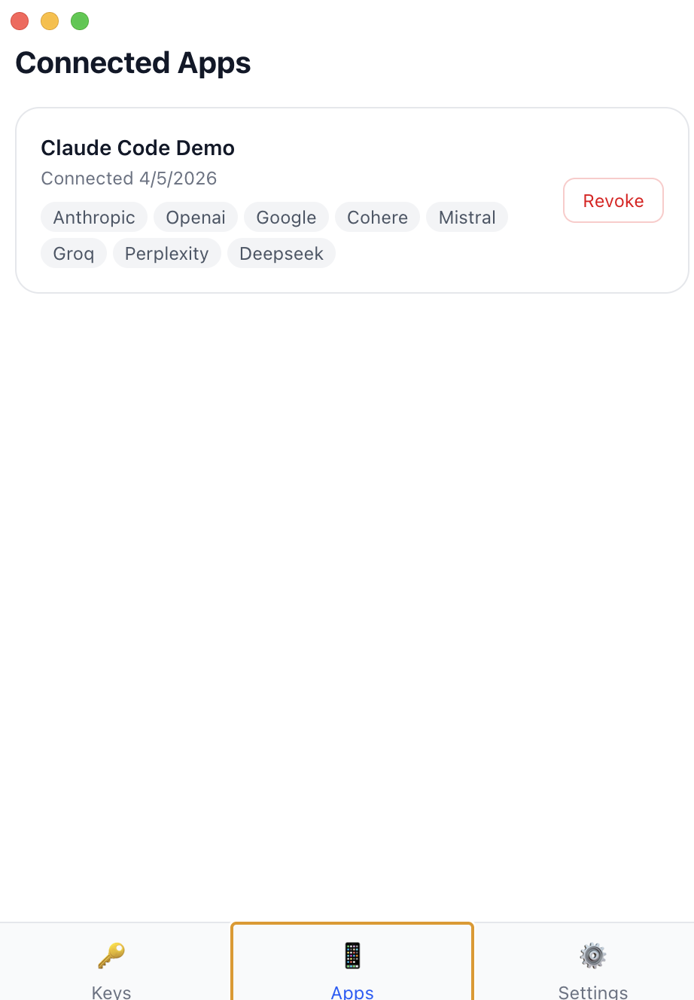

# AI API Wallet

**Apple Pay, but for API keys.**

Stop copy-pasting API keys. Stop losing them in `.env` files. Stop storing them in plaintext.

AI API Wallet captures your API keys from provider dashboards, encrypts them with AES-256-GCM in macOS Keychain, and delivers them to every tool you use — automatically.

```
You sign up for Claude API
  → Browser extension captures the key (zero copy-paste)
  → Wallet encrypts it in macOS Keychain
  → Open terminal → ANTHROPIC_API_KEY is already set
  → OpenClaw, VS Code, Python, any SDK — just works
```

<p align="center">
  
  &nbsp;&nbsp;&nbsp;
  
</p>
<p align="center">
  <em>Left: Your API keys, encrypted and masked. Right: Connected apps with one-click revoke.</em>
</p>

---

## How It Works

### Keys In: Browser Extension Auto-Capture

Visit `console.anthropic.com`, generate a key. A toast appears:

> **"Save to AI Wallet?"** → Click Save. Done.

The Chrome extension watches Anthropic, OpenAI, and Google AI Studio dashboards. When a key appears in the DOM, it captures it and sends it to the wallet. You never touch the key string.

### Keys Out: Environment Variable Injection

Every new terminal session automatically has your keys:

```bash
# Added to ~/.zshrc (one-time setup):
eval "$(ai-wallet-cli env)"

# Every terminal now has:
# export ANTHROPIC_API_KEY="sk-ant-..."
# export OPENAI_API_KEY="sk-..."
# export GOOGLE_API_KEY="AIza..."
```

Any SDK that reads env vars — Anthropic, OpenAI, LangChain, LlamaIndex — works with zero configuration.

### App Authorization

Apps request access through a pairing flow:

```
App → requests key → Wallet shows dialog:
  "OpenClaw wants your Anthropic key. Allow?"
  → [Deny] [Allow]
```

One-time approval. Bearer token stored. App never asks again.

---

## Architecture

```
┌─────────────────────────────────────┐
│         AI API Wallet App           │
│         (Electron + React)          │
│                                     │
│  ┌─────────────────────────────┐    │
│  │  Encrypted Key Vault        │    │
│  │  Anthropic  sk-ant-a...ZwAA │    │
│  │  OpenAI     sk-...a8f3      │    │
│  │  Google     AIza...b2c1     │    │
│  └─────────────────────────────┘    │
│                                     │
│  Daemon API (localhost:21520)       │
│  Browser Extension (Chrome MV3)     │
│  CLI Shell Hook (ai-wallet-cli)     │
└─────────────────────────────────────┘
```

**5 packages in a TypeScript monorepo:**

| Package | What it does |
|---------|-------------|
| `vault-core` | AES-256-GCM encryption, macOS Keychain storage, key CRUD |
| `daemon` | Fastify server on localhost — REST API for key access |
| `desktop` | Electron app — UI, system tray, pairing dialogs |
| `browser-extension` | Chrome MV3 — auto-captures keys from provider dashboards |
| `cli` | Shell hook — `ai-wallet-cli env` exports keys to terminal |

---

## Security

| Invariant | How |
|-----------|-----|
| Keys encrypted at rest | AES-256-GCM with per-key random IVs |
| Master key in hardware | macOS Keychain via Electron `safeStorage` |
| Network isolation | Daemon binds `127.0.0.1` only, never `0.0.0.0` |
| DNS rebinding protection | Host header validation on every request |
| Tokens hashed | SHA-256 before storage — plaintext never persisted |
| Vault is ciphertext-only | Only masked prefix (`sk-ant-a...ZwAA`) stored in clear |

---

## Quick Start

```bash
# Clone and install
git clone https://github.com/Jamessfks/AI-API-Wallet.git
cd AI-API-Wallet
pnpm install

# Run tests (19 passing)
pnpm test

# Launch the desktop app
cd packages/desktop
node build-main.mjs && npx vite build && npx electron .
```

### Browser Extension

```bash
pnpm --filter @ai-wallet/browser-extension build
```

Then in Chrome: `chrome://extensions` → Developer Mode → Load Unpacked → select `packages/browser-extension/dist/`

### Shell Hook

Add to `~/.zshrc`:

```bash
eval "$(ai-wallet-cli env)"
```

---

## Tech Stack

| Layer | Technology |
|-------|-----------|
| Monorepo | pnpm workspaces + Turborepo |
| Language | TypeScript (strict) |
| Desktop | Electron 35 + React 19 + Tailwind CSS 4 |
| Server | Fastify on localhost |
| Encryption | AES-256-GCM via Node.js `crypto` |
| Key Storage | macOS Keychain (Electron `safeStorage`) |
| Extension | Chrome Manifest V3 |
| Tests | Vitest (19 tests) |

---

## Supported Providers

| Provider | Key Pattern | Env Variable |
|----------|------------|-------------|
| Anthropic (Claude) | `sk-ant-*` | `ANTHROPIC_API_KEY` |
| OpenAI (ChatGPT) | `sk-*` | `OPENAI_API_KEY` |
| Google (Gemini) | `AIza*` | `GOOGLE_API_KEY` |
| Cohere | — | `COHERE_API_KEY` |
| Mistral | — | `MISTRAL_API_KEY` |
| Groq | `gsk_*` | `GROQ_API_KEY` |
| Perplexity | `pplx-*` | `PERPLEXITY_API_KEY` |
| DeepSeek | `sk-*` | `DEEPSEEK_API_KEY` |

---

## API

The daemon exposes a REST API on `localhost:21520`:

```bash
# Health check
curl http://localhost:21520/v1/health

# Pair an app (triggers approval dialog)
curl -X POST http://localhost:21520/v1/pair \
  -H "Content-Type: application/json" \
  -d '{"appName": "My App"}'

# Retrieve a key (after pairing)
curl -H "Authorization: Bearer <token>" \
  http://localhost:21520/v1/keys/anthropic
```

---

## Roadmap

- [ ] MCP server for Claude Code native integration
- [ ] Node.js + Python SDKs (`wallet.getKey("anthropic")`)
- [ ] Config file auto-writing (VS Code, OpenClaw, Cursor)
- [ ] Mobile app + Bluetooth LE proximity key transfer
- [ ] Provider OAuth redirects (zero copy-paste from day one)

---

## License

MIT
